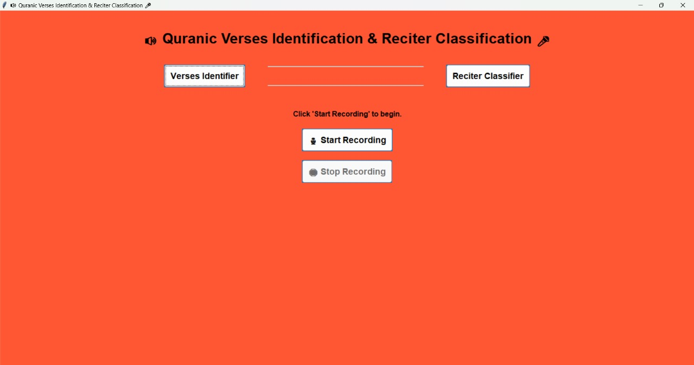
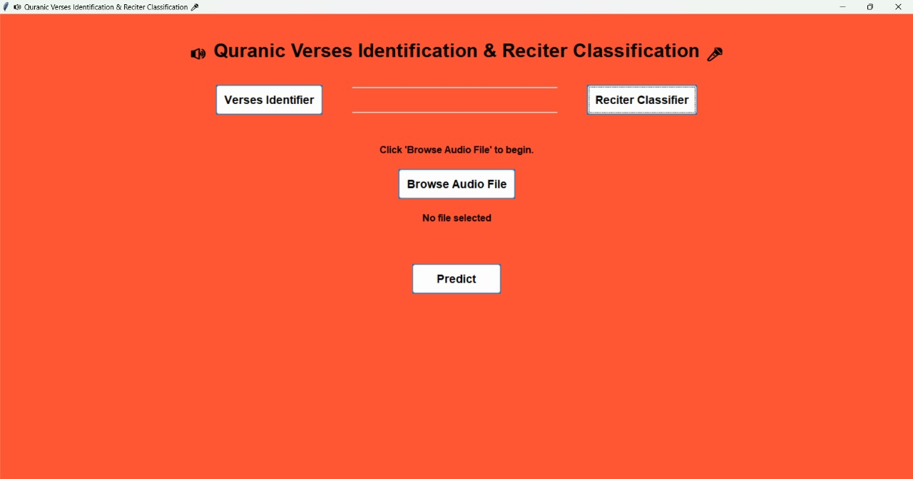
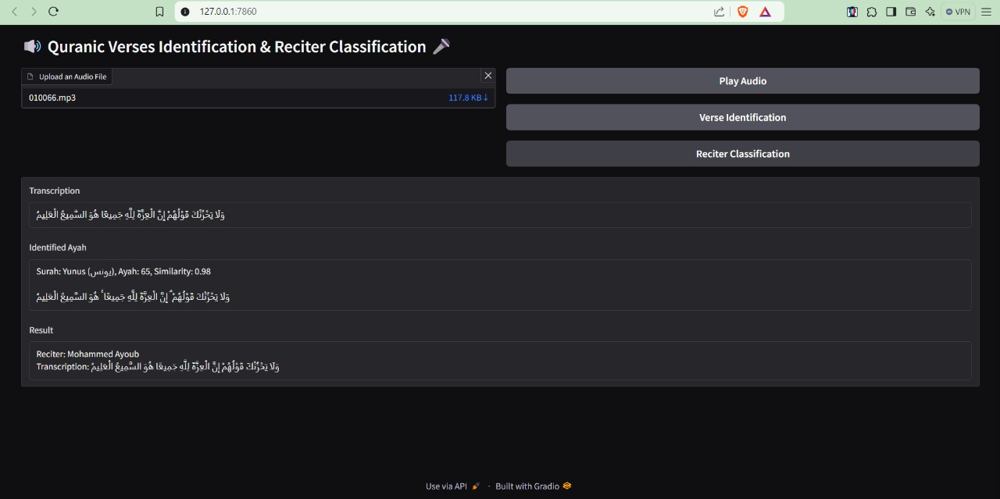

# 🔊 Quranic Verses Identifier & Reciter Classifier 🎤

Welcome to the `Quranic Verses Identification & Reciter Classification` Tool!


## 📝 Overview
This project is a Python-based application that identifies Quranic verses from audio recordings and classifies reciters. It includes both a Tkinter desktop interface and a Gradio web interface for versatility. The application leverages state-of-the-art deep learning models and audio processing techniques. It uses the ["tarteel-ai/whisper-tiny-ar-quran"](https://huggingface.co/tarteel-ai/whisper-tiny-ar-quran) model from Hugging Face's Transformers library for the recognition process.

---

## 🌟 Features

### Quranic Verse Identification
- Upload an audio recording or record directly to identify the verse, Surah, and Ayah number with high accuracy.

### Reciter Classification
- Predicts the reciter's name from the audio recording using a trained deep learning model.

### Dual Interface
- **Tkinter Desktop Application**: Intuitive and user-friendly GUI for desktop use.
- **Gradio Web Application**: Modern and interactive web interface.

### Real-Time Audio Processing
- Record audio directly or upload existing files for processing.

### Text-to-Speech Integration
- Hear the identified Surah and Ayah details through text-to-speech functionality.

---

## 💻 GUI Screenshots







---

## 📂 Project Structure

```
📦 Project
├── 📁 Quran_Reciters_Classification
│   ├── 📁 audios
│   └── 📁 test_audios
│   └── 📄 model.pth
│   └── 📄 files_paths.csv
│   └── 📄 Reciter_Classifier.ipynb
├── 📁 Quranic_Verses_Identifier
│   ├── 📁 surahs_json_files
│   └── 📄 Surah_To_JSON.ipynb
│   └── 📄 Verses_Identifier.ipynb
├── 📄 gradio_app.py
├── 📄 tkinter_app.py
├── 📄 Some_Stats_of_the_Holy_Quran.ipynb
└── 📄 README.md
```

#### 📋 JSON Files
- The tool uses a structured format for Quranic verses stored in JSON files. Each Surah's Text that you can get from [here](https://www.equran.org/) is mapped to a corresponding JSON file containing its Ayahs.

#### 📂 Audios
- 🎤 Reciter Classification Dataset: A [dataset](https://www.kaggle.com/datasets/mohammedalrajeh/quran-recitations-for-audio-classification) from **Kaggle** was employed, containing audio recordings from 12 different reciters for training the reciter classification model.
- 🔊 Testing Audio Files: A selection of random audio files was sourced from a trusted [website](https://everyayah.com/) to assess and validate the model's performance.

---

## 🛠️ Technologies & Libraries Used

- **Python**
- **Deep Learning**: PyTorch, Transformers
- **Audio Processing**: Torchaudio, SoundDevice, Playsound
- **Frontend**: Tkinter, Gradio
- **Text-to-Speech**: Pyttsx3

---

## 🚀 How to Run the Application

#### Prerequisites

- Python 3.8+ installed.
- Required Python libraries:

```
pip install requiremets.txt
```

#### Launch the Gradio app:
```
python gradio_app.py
```

#### Running the Tkinter Desktop Application:
```
python tkinter_app.py
```

---

## 🌟 Extra Part - Holy Quran Analysis using Python

The `Some_Stats_of_the_Holy_Quran.ipynb` notebook aims to analyze the Quranic text using Python. The analysis covers linguistic, cultural, and religious aspects of the Quran to gain deeper insights.

#### Goals
- **Linguistic Analysis**: Study verses distribution and analyze their frequencies.
- **Cultural Analysis**: Understand the distribution of key concepts in the Quran.
- **Religious Analysis**: Investigate the distribution of mentions of prophets and get insights into the distribution of important concepts.

---

#### 🤲 Alhumdallah for completing this project. Feel free to explore, provide feedback, and connect with us for discussions and collaborations! 🤝
